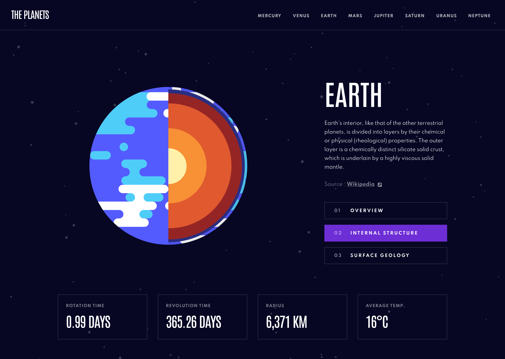

# Planets facts site - Frontend Mentor Project

## Table of contents

- [Intro](#intro)
- [The challenge](#the-challenge)
- [Link](#link)

### Intro

Hi there !✨  
Here is my solution for the [Planets facts site - Frontend Mentor Project](https://www.frontendmentor.io/challenges/planets-fact-site-gazqN8w_f/hub/planets-fact-site-0EOwO46m8). This will be my first Frontend Mentor's intermediate level.

The main tools I'll be using are :

- **_React.JS_** library
- **_React Router_** library
- **_Styled components_** library
- **_Prettier_** formatter

## The challenge

> Your challenge is to build out this 8-page planets fact site and get it looking as close to the design as possible.
>
> You can use any tools you like to help you complete the challenge. So if you've got something you'd like to practice, feel free to give it a go.
>
> If you choose to use a JS-heavy approach, we provide a local `data.json` file for the planets. This means you'll be able to pull the data from there instead of using the separate `.html` files.
>
> Your users should be able to:
>
> - View the optimal layout for the app depending on their device's screen size
> - See hover states for all interactive elements on the page
> - View each planet page and toggle between "Overview", "Internal Structure", and "Surface Geology"

## Link

[Frontend Mentor](https://www.frontendmentor.io) challenges allow you to improve your skills in a real-life workflow.
